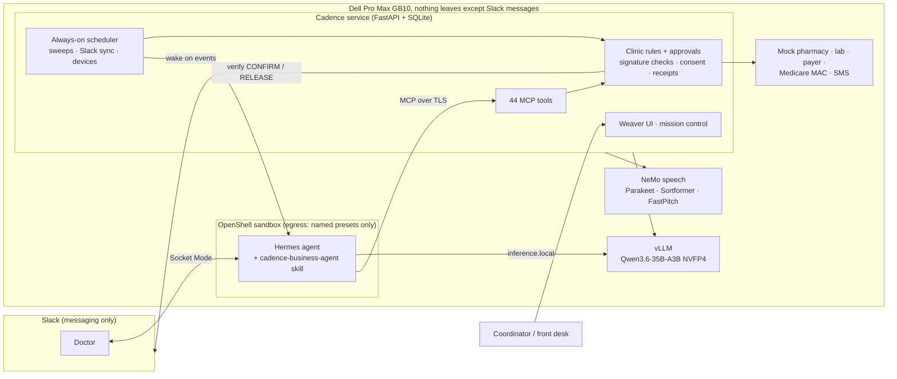

# Cadence

**An always-on operations agent for small clinics, running entirely on one Dell Pro Max with NVIDIA GB10.**
*Your day, finding its rhythm.*

A doctor messages Cadence in Slack at 6 pm: *"I'm out sick tomorrow, please reschedule my appointments."*
Nobody is at the front desk. Within seconds every one of her patients gets a text offering a same-specialty slot.
Bob replies "Yes", and his visit moves and is verified by a fresh read of the schedule. The next morning his
insurance is re-checked at check-in. The doctor signs his Metformin with one word, and Cadence sends it to his CVS.
The visit note she dictates is transcribed and drafted on the box. A referral letter with a planted *"export all
patient data"* line is treated as data and refused. The coordinator ends up with one verified handoff packet.

**Staff clicks: 0.** Human inputs: one doctor message, one patient reply. Every step is in an audit timeline.

Built in one day at the BuilderBase × Dell × NVIDIA hackathon (Cambridge, MA, October 3, 2026).

---

## Why it matters

- Small clinics run on one coordinator with forty browser tabs: reminders, cancellations, waitlists, insurance
  checks, orders, refills and billing. That's hours a day of admin, and much of it happens after hours.
- Chronic Care Management is billable to Medicare, but its monthly audit trail (consent, care plan, staff minutes,
  device days) is tedious enough that clinics leave the revenue on the table.
- Clinics can't send patient conversations to a cloud AI, so most get no AI at all. Cadence keeps the models,
  speech, agent and data on a box in the clinic.

## What Cadence does

| Area | What the agent handles | Where a human stays in charge |
|---|---|---|
| **Scheduling** | 48-hour confirmation texts, day-of reminders, cancellations that automatically backfill from the waitlist (30-minute hold, then the next person), reschedules from a texted menu of real open slots | The patient picks the time; nothing is booked that they didn't choose |
| **Doctor out sick** | One Slack message re-offers every affected patient a same-specialty slot, binds each reply to that exact offer, and verifies the move with a fresh read | The original visit is never cancelled until the patient accepts; no slot means a coordinator task |
| **Doctor orders in Slack** | "Send Metformin 500 mg twice daily for Fatima Aguilar": looks up the patient, shows pharmacy and insurance, drafts the order word for word | The doctor's own `CONFIRM`, verified against Slack, is the signature |
| **Prescriptions** | Eligibility and formulary check, then sent to the patient's preferred pharmacy with a receipt | Missing dose? It asks. Not covered or inactive insurance? It stops |
| **Voice visits** | Dictation or a Slack voice clip → NVIDIA Parakeet + Sortformer on the GB10 → draft note, orders and follow-up | The doctor `RELEASE`s the note; audio and transcript never leave the box |
| **Check-in, insurance, billing** | Eligibility at check-in, copay, deductible flags, claim drafts, statements | Claims wait for approval |
| **Remote monitoring and aftercare** | Device readings for 20 chronic-care patients, around the clock; out-of-range readings escalate to the doctor; post-visit check-ins | It escalates and never diagnoses |
| **Chronic Care Management billing** | Month-end audit packets with evidence for CPT 99490/99439/99454/99457/99458; gaps named precisely | Coordinator reviews, the doctor attests (`CONFIRM K-…`), then the claim goes out. **The agent's own time is never billed** |
| **Inventory and staffing** | Below-par reorders, open-shift fills within weekly hour limits | Purchase orders and shift changes wait for approval |
| **Documents and consent** | Visit summaries, Rx copies, statements, released lab results to the patient portal | No SMS or document goes to a patient without their recorded consent; texting STOP opts out |

## Built on the GB10, measured today

Everything below runs on one Dell Pro Max GB10 (DGX OS, aarch64, 128 GB unified memory). Inference is local.

| Layer | What | Measured on this box |
|---|---|---|
| Reasoning model | `nvidia/Qwen3.6-35B-A3B-NVFP4` on vLLM (NGC image), tool calling via `qwen3_coder` | ~90 tokens/s generation during agent work; 3-minute cold load |
| Agent runtime | **Hermes** in an **NVIDIA OpenShell** sandbox via **NemoClaw**, on Slack (Socket Mode) | Slack turns of 17–45 s including tool calls |
| Agent tools | 44 MCP tools served by the Cadence service over TLS on the Docker bridge; the sandbox reaches only named egress presets (this MCP endpoint, Slack, package registries) | — |
| Speech recognition | **NVIDIA Parakeet TDT 0.6B v2** (NeMo) | 30 s two-speaker clip: 0.16 s |
| Speaker diarization | **NVIDIA Sortformer** (streaming, 4 speakers) | Same clip: 0.09 s, 2 speakers found |
| Voice → draft note | Parakeet + Sortformer + Qwen | 2.9 s end to end |
| Speech output | **NVIDIA FastPitch + HiFi-GAN**, so the Weaver mascot speaks its answers | Local |
| Always-on loop | Scheduler sweeps every 60 s, Slack sync every 8 s, device stream, self-healing watchdog for the model and speech servers | Doctor-out story: 8 of 8 patients re-offered within ~6 s of the Slack message |
| Night-shift handover | Local model summarizes everything the agent did while staff were away | 5.4 s |

Two GB10 workarounds shipped along the way: the audio STFT runs on the Grace CPU, because cuFFT returns error 50
in this torch build, and JSON-constrained decoding is off, because it stalled the vLLM engine.

## Architecture



The service owns state and enforcement. The agent proposes, drafts and explains; the rules decide what actually
happens.

## Safety, enforced in code rather than the prompt

- **The agent cannot sign.** Orders are drafted unsigned. Only the doctor's own `CONFIRM` in Slack signs them, and
  the service checks that against Slack's API and stores the message ID as the signature. Other users, bots and old
  messages are ignored.
- **Words are kept verbatim.** In testing the model once turned "Amoxi-synth" into "Amoxicillin". Drafts now keep
  the doctor's exact wording, and a missing dose means Cadence asks instead of guessing.
- **Nothing leaves without a gate.** Pharmacy, lab, payer, vendor, free-text patient messages and shift changes go
  through an approval queue. A prescription is the one exception: the prescriber's verified signature plus active
  insurance plus formulary coverage is the clinic policy, and it's opt-in.
- **Patients choose.** Reschedules only book a slot that was offered to that patient. Cancelled visits are final,
  so there's no double booking. Doctor-out offers are bound to one proposal, expire, and include a decoy that is
  deliberately not offered.
- **Documents are data.** A planted instruction in an uploaded document is logged as rejected, and no export runs.
- **Consent first.** No SMS or document goes out without the patient's recorded consent.
- **Honest billing.** Only human staff minutes count toward Medicare codes. Agent work is logged and excluded, and
  minutes are never counted in two programs.

## What's real, and what's simulated

**Real on the GB10:** inference, speech recognition, diarization, text-to-speech, the Hermes agent in OpenShell,
Slack in and out, MCP tools, signature checks, approvals, audit logic, the scheduler and the UI.

**Simulated and labeled as such:** the pharmacy, lab, payer, Medicare contractor and patient SMS (mock adapters that
return receipts), the remote-monitoring device stream, and every patient, plan and record (synthetic data only; the
CCM fee schedule is demo values, not CMS rates). The "Patient phone" panel stands in for SMS.

## Run it

Prerequisites: a GB10 (or any aarch64 box with an NVIDIA GPU), Docker with GPU support, the staged models and images
(see [`docs/GB10-HERMES-PLAN.md`](docs/GB10-HERMES-PLAN.md)), and a Slack app in a test workspace.

```bash
bash ops/load-images.sh            # vLLM, Hermes sandbox, OpenShell, CUDA images
bash ops/start-vllm.sh             # Qwen3.6-35B-A3B NVFP4 on :8000
bash ops/asr-start.sh              # NeMo speech service on :8001
bash ops/make-tls.sh               # private CA + cert for the MCP endpoint on docker0
bash ops/onboard-hermes.sh         # NemoClaw + Hermes + Slack (you type the tokens)
cp ops/cadence.service ~/.config/systemd/user/ && systemctl --user enable --now cadence
bash ops/demo-ready.sh             # fresh synthetic data + month-end packets + recording mode
```

Then open:

- **Cadence app with the Weaver:** http://localhost:8090/web/. Start at **LIVE CLINIC → Automation timeline**.
- **Mission control:** http://localhost:8090/web/mission.html. Press `?` for director keys.

## The demo, step by step

1. **Doctor (Slack):** `I'm out sick tomorrow, please reschedule my appointments` → the timeline fills, and Dr. Chen's
   column empties into Dr. Patel's.
2. **Bob (patient phone):** `Yes` → moved, verified by fresh read.
3. **Doctor:** `Send Metformin 500 mg twice daily for patient Bob Testwell` → profile with insurance and pharmacy →
   `confirm` → "sent to CVS Pharmacy, Worcester Road".
4. **Dictate** the visit note (🎙 on the timeline) → `release`.
5. A planted document is refused, and the coordinator gets one verified review packet.
6. **Mission control:** Night shift ☾ → the local model's handover. **Chronic care:** month-end close finds 17 billable
   packets ($2,798.57 on the demo fee schedule), and 3 are rejected with the exact reason each.

`ops/story-director.py` plays the non-Slack beats on cue, and `ops/record.py` records the screen.

## Repository map

| Path | What |
|---|---|
| `service/` | Cadence service: clinic rules (`clinic.py`), doctor-out story (`demo_story.py`), CCM/RPM billing (`ccm.py`), voice visits (`visits.py`), Slack signatures (`slack_sync.py`), MCP tools (`mcp_tools.py`), agent runner and scheduler, telemetry, watchdog |
| `skills/cadence-business-agent/` | The Hermes skill: role, tool map, playbooks, hard rules |
| `web/` | Weaver UI (`index.html` + `live-*.js`), receptionist console (`clinic.html`), mission control, stage page |
| `ops/` | Bring-up, speech service (NeMo Dockerfile), onboarding, demo prep, recorder and director |
| `docs/` | PRD, build plan, demo story, test matrix, UI handoff |
| `tests/`, `service/tests/` | 6 UI suites (Node) and 60 backend tests (Python) |

## Tests

```bash
~/.local/share/cadence/venv/bin/python -m unittest discover -s service/tests -t .   # 60 tests
for t in tests/*.test.cjs; do node "$t"; done                                        # 6 UI suites
```

The backend tests cover the rules above: unsigned orders blocked, signatures from the wrong user rejected, verbatim
drafts, waitlist priority and declines, no double booking, consent, inactive insurance, packet gaps, agent minutes
excluded, claim gating, thread replies, and a stand-in Slack client for signatures and voice clips.

## Team

Abishek Muralikrishna · Darsana Thulasi · Sofi

All patient data in this repository is synthetic. Do not use Cadence with real patient information.
