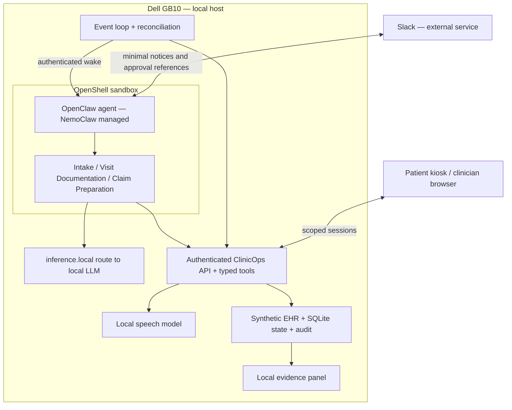

# ClinicOps — Product Requirements Document

**Version:** 1.3 · September 28, 2026  
**Build:** two people, one day · Dell Pro Max with GB10  
**Interfaces:** staff in Slack; patient simulated in a local kiosk  
**Status:** implementation specification; no GB10 runtime validation claimed

## 1. Product and problem

ClinicOps is an always-on operations manager that carries a patient’s administrative work from appointment preparation through a claim packet ready for coordinator review. It notices changed availability, checks insurance, requests missing evidence, completes permitted administrative actions, and verifies each result.

Clinic staff repeatedly reconcile the schedule, insurance response, visit documentation, and billing checklist. A change in one system leaves unfinished work in another. The demo shows one patient journey in which the agent keeps those dependencies moving, with staff involved at explicit decision points.

**Pitch:** “Clinic staff spend their day catching work that slips between the schedule, the insurer and the health record. ClinicOps catches it, completes the permitted work, asks for the missing decisions, and shows the evidence—using models running on this GB10.”

The [Boston event listing](https://luma.com/rvinoam5) specifies October 3, a 10:30–18:00 build window, the local NemoClaw/OpenClaw/OpenShell stack, an actual messaging integration, autonomous tool use, and business work. Our target is a three-minute demo; pitch length and scoring rubric are not published. Feature freeze is 16:15, backup recording 17:00, submission target 17:30. Permission for application code prepared before the event remains unconfirmed; this plan does not depend on it.

## 2. Confirmed decisions and changes

- Two builders, one real Slack connector. Patient actions occur in the local kiosk; Telegram is deferred.
- One hero journey, `CASE-104`, with pre-visit, visit, and post-visit milestones. Pre-visit work is completed before the pitch and shown as timestamped history. The live hero is missing-document recovery through verified packet readiness.
- The previous standalone authorization rescue, waitlist, and unsigned-note cases become alternate scenarios. Do not add them to the three-minute journey.
- The uploaded missing document supplies the prompt-injection test fixture. A real OpenShell denial must have actual runtime evidence; a model refusal is labeled separately.
- The local evidence panel is mandatory. Vitals monitoring, Telegram and additional agents are excluded from the event build; retain them only as future roadmap items.
- Use one OpenClaw agent with three workflow modules. Multiple specialist agents are deferred.

## 3. Users and stories

| User | Story | Acceptance evidence |
|---|---|---|
| Patient, simulated | I can confirm an appointment and accept a new slot when the doctor becomes unavailable | Authenticated kiosk response and independently verified booking |
| Scheduler | I approve a suitable replacement before it is offered | Verified Slack approval bound to that exact proposal |
| Front desk | I see eligibility and a deductible flag before check-in | Timestamped mock payer response; source and amounts visible locally |
| Patient, simulated | I check in and confirm administrative profile fields | Visit-bound kiosk session and change audit |
| Clinician | I review a local transcript and supply the missing signed document | Local draft review, authenticated upload, provenance and hash |
| Coordinator | I receive a complete draft claim packet with evidence | Manifest, source versions, unresolved-item list, verification result |
| Practice manager | I see work start without a prompt and know why an item is blocked | Persistent event timeline, next owner, last verified time |
| Judge | I see local inference, a real policy boundary, and a business outcome | Live telemetry and source-backed completion rather than chat alone |

## 4. Goals and non-goals

### MVP goals

1. Automatically process an appointment due for confirmation, read synthetic insurance eligibility, and flag a configured high remaining deductible.
2. Detect changed doctor availability, propose a valid replacement, obtain scheduler approval and patient acceptance, then verify the reschedule.
3. Accept local kiosk check-in and patient-confirmed administrative profile edits.
4. Transcribe a short synthetic recording on the GB10; produce one small cited visit-summary draft for clinician review. Full clinical profile updating is deferred.
5. Detect a missing signed encounter document and request it from the assigned doctor through Slack and an authenticated local upload page.
6. Assemble and independently verify a draft claim packet for coordinator review once its required evidence is complete.
7. Display timeline, local model routing, GPU/throughput measurements, actual OpenShell denials, and measured business outcomes.
8. Persist pending work through restart and prevent duplicate writes.

### Non-goals

Clinical diagnosis or triage; treatment recommendations; autonomous clinical record changes or signatures; real patient data; real payer adjudication or claim submission; real eligibility integration; emergency monitoring; autonomous billing codes or reimbursement guarantees; a HIPAA compliance claim; Telegram; specialist-agent orchestration.

The prototype is synthetic. Local inference does not make Slack local or establish compliance. Production use would require a separate organizational, security, clinical, and contractual review.

## 5. Scope

| Capability | MVP delivery | Deferred |
|---|---|---|
| Appointment confirmation | Local patient inbox/confirmation control | SMS, voice calls, Telegram |
| Eligibility and deductible | Mock response with timestamp and factual flag | Real clearinghouse, benefit interpretation, payment collection |
| Doctor-driven reschedule | One valid alternate and one unavailable decoy; Slack approval; kiosk acceptance; versioned write | Optimized scheduling and general waitlist recovery |
| Kiosk | One fixture patient; check-in, consent, administrative fields | Identity proofing, production patient portal |
| Speech/documentation | Short synthetic audio; real local ASR; one reviewed visit-summary draft | Full clinical profile updates, long consultations, diarization |
| Missing document | One required signed document; authenticated local upload | OCR, arbitrary file types, EHR ingestion |
| Claim packet | Local manifest and readable summary with traceable evidence | EDI/837 generation, real claim submission/adjudication |
| Security/evidence | Real denial evidence plus continued workflow | General adversarial benchmark |
| Monitoring | Excluded from event build | Simulated alert/check-in first; devices and clinical service later |
| Other operations | Roadmap: authorizations, denials, referrals, no-shows, overdue follow-ups, billing exceptions | Additional event-day detectors |

## 6. End-to-end hero journey

### A. Before the visit — completed before the pitch

Run this sequence before presenting and retain its actual audit records. Show a compact history summary rather than reenacting the forms on stage. If a step is only seeded fixture context, label it as such; it cannot count as agent-completed work.

1. The source simulator emits `appointment.confirmation_due`; the running service detects it without a Slack prompt. The patient kiosk shows a confirmation request.
2. The agent requests eligibility for `P-104` and `APT-104`. The mock payer returns active coverage, service date, network/benefit context, deductible total and remaining amount. All values are synthetic.
3. A deterministic fixture rule flags remaining deductible above a configured threshold; e.g. $1,800 remaining against a $1,000 demo threshold. Label this “deductible review needed,” with “eligibility is not a payment guarantee.” It is not an amount owed or a clinical urgency rule.
4. The patient confirms. A subsequent `provider.availability_changed` invalidates the original slot.
5. The agent reads valid alternatives. The scheduler gets a Slack DM explaining the change and one proposed slot. A server-verified approval permits that offer only.
6. The patient accepts in the kiosk. The action service rechecks slot and appointment versions and atomically moves the appointment. A fresh scheduler read verifies the new time and status. Decline, expiry, or conflict leaves an explicit unresolved task; do not silently cancel the existing appointment.
7. If the new service date changes the scope of the eligibility response, refresh it before declaring pre-visit checks complete.

**Accept:** one confirmation per version; no reschedule before approval and acceptance; no double booking; eligibility tied to the actual service date; patient sees the verified new time.

### B. At the visit

1. A clearly labeled fixture clock advances to the rescheduled visit; no claim that real days elapsed in three minutes.
2. The patient checks in using a session scoped to that appointment, confirms demographics/administrative preferences, and acknowledges the synthetic audio demonstration.
3. A 10–15 second pre-recorded synthetic clip is transcribed live by a local ASR service on the GB10. A live microphone is optional. Audio, transcript and extracted clinical draft stay local.
4. The local LLM produces one short visit-summary draft with transcript/source references. A clinician reviews the exact version locally before it can enter the packet. Keep this to one small card; no full clinical profile merge, agent signature or autonomous diagnosis/coding. Patient-confirmed administrative fields remain a separate allowlisted path.
5. The checklist discovers that a required signed encounter document is absent. The agent asks the assigned doctor in Slack and provides a local upload entry link. The doctor authenticates in the local browser and uploads a synthetic text/PDF fixture.
6. The service checks case/encounter ownership, file type, size, document status, hash and required metadata. A fixture label alone is not proof of a real clinical signature. The demo explicitly simulates the clinician’s signed-document attestation.
7. The document contains an untrusted export instruction. The agent can use legitimate evidence without treating embedded instructions as authority. Show the actual refusal/denial outcome, then continue.

**Accept:** mismatched visit sessions fail; no cloud ASR; no unreviewed clinical draft enters the packet; missing/unsigned/wrong-encounter documents keep the packet blocked; unauthorized upload fails.

### C. After the visit

1. `encounter.completed` triggers the packet checklist. If evidence is missing, retain `WAITING_DOCUMENT` and an assigned clinician. Do not mark billing-ready prematurely.
2. Once the signed document and required reviewed data are present, the agent asks the service to assemble the packet from permitted evidence IDs.
3. Packet contents: appointment/check-in proof, eligibility response with caveats, reviewed encounter summary, signed-document reference, supplied mock billing fields, and a manifest listing provenance, source versions, hashes, actions and approvals. No codes or patient facts are invented to fill gaps.
4. Verification re-reads the current owning sources, validates requirements and hashes, and checks that versions still match. Then publish `READY_FOR_COORDINATOR_REVIEW` with a private local link. This is not submitted, accepted by a payer, paid, or independently certified as audited.
5. The coordinator receives a minimal Slack handoff and opens the packet locally. Coordinator acknowledgment may close the handoff task separately from packet readiness.

**Accept:** each included item has provenance; any missing requirement/version drift prevents readiness; packet generation is idempotent; Slack contains no chart/audio attachments.

### D. Future roadmap: simulated vitals check-in

A synthetic `vitals.alert_simulated` fixture matches a preconfigured demo rule. The agent creates an administrative follow-up and places a predefined “Please check in with the care team” message in the kiosk. It records acknowledgment and alerts staff if no response arrives within a simulated interval. No interpretation, treatment, emergency coverage or automated reassurance. Show a permanent “simulated monitoring” label. Do not implement this during the event; it is a follow-on experiment after the hackathon.

## 7. Architecture and the supplied diagram

Retain the diagram’s local processing boundary and central router concept, with these corrections:

- Label the router **OpenClaw agent, managed by NemoClaw**. Its three branches are **Intake & Scheduling**, **Visit Documentation**, and **Claim Preparation** modules with typed tools; no separate model instances required.
- Replace “Clinical Triage” with “Visit Documentation.” Add local ASR, kiosk/upload routes, the action service, durable event loop and audit store.
- Draw an **OpenShell sandbox inside the GB10 host boundary**. Host services have separate authentication and application controls; they do not automatically inherit the sandbox’s egress protection.
- Show `inference.local → verified local model endpoint` and a separate local ASR route. All three modules use the same model route.
- Put Slack outside the host boundary, with outbound minimal operational notices and inbound commands/verified approval references. Kiosk clients use authenticated local access.
- Label storage “synthetic EHR + audit store.” Do not label ordinary SQLite “encrypted PHI” unless encryption is actually configured and verified.



The model plans and explains. The deterministic action service owns validation, permissions, writes and verification. An always-running event service handles source updates and reconciles open work every 30–60 seconds. Human clicks are genuine approvals/data entry; they are not required to prompt every agent step.

## 8. Data graph and lifecycle

Nodes: patient alias, appointment, provider availability, eligibility response, reschedule proposal, patient acceptance, check-in, audio asset, transcript, summary draft/review, document request/upload, encounter, packet, approval and audit event.

Edges: `belongs_to`, `scheduled_for`, `invalidates`, `accepted_by`, `derived_from`, `reviewed_by`, `requires`, `satisfies`, `included_in`. Every clinical draft references its transcript; every packet item references its source and version.

One `journey_id` connects module tasks; keep milestone states separate so “rescheduled” does not mean “claim ready.” Each task uses:

```text
DETECTED → INVESTIGATING → PLAN_READY → EXECUTING → VERIFYING → RESOLVED
                          ↘ WAITING_APPROVAL / WAITING_PATIENT
                          ↘ WAITING_REVIEW / WAITING_DOCUMENT
Any stage → ESCALATED or FAILED with owner and next action
```

The packet separately uses `BLOCKED → ASSEMBLING → VERIFYING → READY_FOR_COORDINATOR_REVIEW`. A source change invalidates the readiness badge and requires re-verification. General automatic case reopening is deferred. Persist source versions, actor identity, timestamps, idempotency keys, approval scope and verification evidence.

## 9. Slack and local UX

Slack has one case thread and role-specific DMs. Use text approval commands for MVP, e.g. `approve CASE-104 R7K2`. The service independently retrieves and validates the exact Slack message; the LLM cannot assert the approver’s identity. A grant binds to proposal, case version, target slot and expiry.

Example messages:

> **CASE-104 · Schedule change** — The provider is unavailable. Proposed replacement: Oct 6, 10:30. Approve this offer with `approve CASE-104 R7K2`. Patient acceptance is still required.

> **CASE-104 · Document needed** — The signed encounter document is missing. Assigned clinician: please open the local document page. Packet remains blocked.

> **CASE-104 · Packet verified** — Required evidence is present and current. Ready for coordinator review at 14:32. Local packet link. No claim submitted.

Local pages: `/kiosk` (patient confirmation, reschedule, check-in), `/clinician` (draft review, upload), `/packets/{id}` (coordinator), `/demo` (evidence panel). Distinct role sessions remain enforced even if both builders share the projected browser. No actual patient information in Slack. Links require local reachability plus server-side role checks; a link alone is not authority.

## 10. Approval boundaries

| Action | Authority |
|---|---|
| Read fixture; verify mock insurance; flag deductible; ask for missing document | Autonomous within scoped policy |
| Offer replacement slot | Explicit scheduler approval for exact proposal |
| Move appointment | Verified patient acceptance plus current availability and valid grant |
| Update administrative profile fields | Patient-confirmed allowlisted fields only |
| Transcribe and draft clinical text | Autonomous draft; clinician approves exact summary version before packet inclusion |
| Upload/attest signed document | Authenticated assigned clinician; synthetic attestation only |
| Build and verify draft packet | Autonomous after required evidence/reviews |
| Submit real claim, invent code, sign note, change treatment | Prohibited |
| Change sandbox policy, inference provider or credentials | Operator only |
| Simulated vitals follow-up | Post-event only; predefined administrative message |

## 11. The visible local and security evidence

Keep Slack left, local browser right. The right page can show kiosk/clinician content while retaining a compact evidence strip; return to the timeline after each interaction.

Four persistent facts: (1) live timeline, (2) actual GPU and model measurements, (3) verified local LLM and ASR endpoints with zero hosted inference providers, (4) OpenShell denial count and latest correlated event. Unsupported metrics show N/A; stale route checks show unknown. ASR displays audio duration and processing duration, not tokens/sec.

The uploaded fixture contains a prompt-injection instruction. If the agent refuses, show “instruction rejected by agent.” If an actual request from the sandbox is denied, show “OpenShell blocked egress” with destination, timestamp and policy evidence. Do not simulate a denial animation. To guarantee a reproducible boundary demonstration without weakening the model, use a separately labeled, fixed operator-triggered sandbox probe with a harmless marker and a controlled test receiver. Confirm the matching denial and no received marker. A host-side request, timeout, or app validation error is not evidence of OpenShell enforcement. Continue the legitimate packet workflow after the probe. OpenShell network rules do not semantically prevent chart leakage through an allowed Slack destination; application data minimization remains required.

## 12. Three-minute script — committed stage scope

The memorable outcome is **the agent finds a blocked packet, requests the missing evidence, handles an unsafe instruction, and verifies completion**. Local transcription is the visible GB10 capability leading into that workflow.

| Time | Show / say |
|---|---|
| 0:00–0:20 | “This patient is checked for coverage and rescheduled, but the visit still has work waiting behind it.” Show timestamped pre-visit history: confirmation, eligibility, deductible flag, verified reschedule. Label earlier execution clearly. |
| 0:20–0:50 | Brief kiosk check-in. Submit the short synthetic recording; transcribe it live on GB10 while the local evidence strip remains visible. |
| 0:50–1:10 | Show one cited visit-summary draft. Clinician reviews it; encounter completion triggers the agent to find the missing signed document without a new prompt. |
| 1:10–1:40 | Slack document request appears. Clinician follows authenticated local link and uploads the fixture. Show the case waiting, then resuming automatically. |
| 1:40–2:10 | Highlight the hostile instruction. Show actual refusal and a separately labeled genuine OpenShell boundary probe/denial as applicable. Legitimate work continues. |
| 2:10–2:40 | Agent builds the packet; service verifies sources, hashes and review. Show coordinator Slack handoff and readable manifest. |
| 2:40–3:00 | Close with measured blocker-to-ready time, human interactions and local inference evidence. “It found the unfinished work, got the missing evidence, and verified the handoff.” |

Pre-visit history is always pre-completed in this stage script, not a last-minute fallback. Preload models, role sessions and fixtures. Builder 1 narrates/uses Slack; Builder 2 operates labeled patient and clinician roles. Keep check-in and review brief but genuine. No live rescheduling, long profile editor, monitoring, Telegram or extra-agent scene.

These are rehearsal budgets, not promised latencies. Start the event service before the pitch and let source events, document arrival and reconciliation drive the agent. Do not prompt it manually at each transition. If live inference stalls, report the actual state and use labeled backup footage.

## 13. Business metrics and definition of done

- Detection latency: source event committed → task detected. Report real observed duration; simulated business date is separate.
- Packet resolution time: first missing-document blocker → fresh verification succeeds. Also report machine-active time separately from human waits.
- Human work: counted interactions by patient, scheduler, clinician and coordinator. Compare to a timed manual walkthrough of the same fixture. Do not claim the entire journey needed only one approval.
- Synthetic billed amount attached to the packet: display “$X prepared for review.” It is not collected revenue or an insurer commitment.
- Hosted inference fees: $0 only with both LLM and ASR routes verified local; excludes hardware, power and staff time.
- Verified completion: all required source versions/hashes/reviews present; no false-ready result when a dependency is missing.
- Rehearsal reliability: five complete runs with honest pass count, duration and selected fallback. Target five successful runs within the chosen stage budget; these are targets until measured.

Done means the real agent runs in the mandated stack, Slack is live, event-driven initiation works, a local audio clip is actually transcribed, approvals are enforced, and packet readiness follows fresh evidence. Live versus pre-completed versus fallback data is labeled on screen.

## 14. Prioritized stretch goals and cut order

1. After the event: simulated vitals alert → kiosk check-in → staff exception. Excluded from event-day implementation.
2. Reinstate authorization-rescue alternate scenario with real verification.
3. Referral, denial-deadline, no-show and overdue-follow-up detectors.
4. Slack buttons, richer patient kiosk, longer audio and speaker labels.
5. Automatic task reopening and broader temporal/concurrency coverage.
6. Telegram patient connector, with consent and identity controls.
7. Specialist agents only after measured value; authorized real system integrations later.

Event scope is fixed: monitoring, Telegram, additional agents and full clinical profile updates are excluded. Pre-visit work is shown as earlier history. If build time is tight, cut live microphone support and rich document rendering first; prioritize the live document-to-packet path before polishing pre-visit controls. A disclosed transcript fallback preserves the workflow demo but does not satisfy the added live-ASR goal. Preserve real Slack, always-on initiation, enforcement evidence, approval checks and a verified packet.

## 15. Sources and limitations

- [Boston event](https://luma.com/rvinoam5): event constraints; no published scoring/pitch length or confirmed prepared-code rule.
- [NemoClaw overview](https://docs.nvidia.com/nemoclaw/latest/about/overview.html), [local inference](https://docs.nvidia.com/nemoclaw/latest/user-guide/openclaw/inference/local-inference/choose-local-inference-server), [managed MCP](https://docs.nvidia.com/nemoclaw/latest/user-guide/openclaw/manage-sandboxes/mcp-servers/add-an-mcp-server): platform architecture.
- [OpenClaw hooks](https://docs.openclaw.ai/automation/cron-jobs/webhooks), [Slack setup](https://docs.openclaw.ai/channels/slack/setup), [Slack message verification](https://docs.slack.dev/reference/methods/conversations.history/): messaging and event interfaces.
- [OpenShell policy](https://docs.nvidia.com/openshell/reference/policy-schema), [logging](https://docs.nvidia.com/openshell/observability/logging): enforcement evidence.
- [NVIDIA ASR matrix](https://docs.nvidia.com/nim/speech/latest/reference/support-matrix/asr.html): candidate selection; exact Dell image/driver operation must be tested on the supplied machine.

The screenshot is a conceptual reference, not proof of encryption or enforced isolation. The earlier NYC MEDPASS safety story is supported by a [participant report](https://www.linkedin.com/posts/ahamedfofana_last-weekend-my-team-placed-top-3-at-the-activity-7498778057877385216-yexw), not an official judging rubric. No source establishes this project’s odds of winning.
